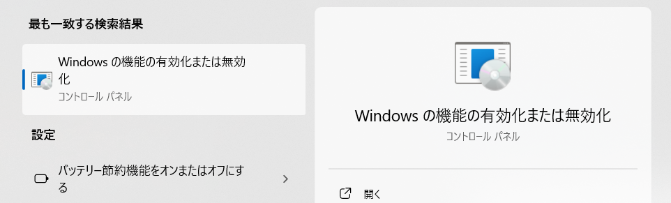
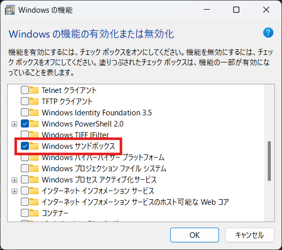
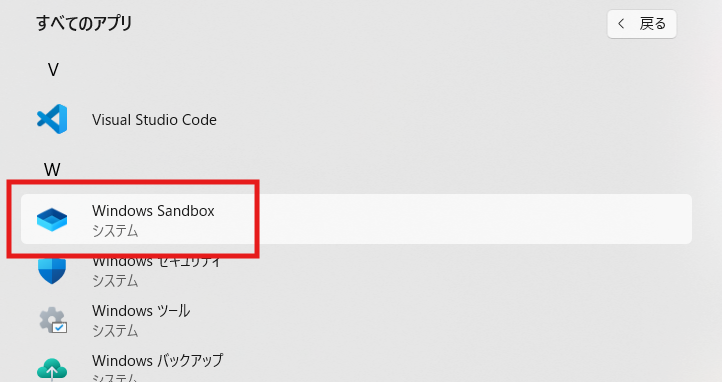

# Windows サンドボックス

1. はじめに

    Windows サンドボックスは、試しにアプリケーションをインストールしたいなど開発時に有効なツールです。

2. Windows サンドボックスのイントール

    [Windowsサンドボックスのインストール](https://learn.microsoft.com/ja-jp/windows/security/application-security/application-isolation/windows-sandbox/windows-sandbox-overview)

   1. 検索ボックスから「Windowsの機能の有効化または無効化」を検索し、クリックします。

       

   2. 「Windows サンドボックス」にチェックを入れ、機能を有効化します。
       

   3. インストールが完了すると、すべてのアプリに「Windows Sandbox」が追加されます。

       

3. セットアップ

    PowerShellから「setup.ps1」を実行し、セットアップを行います。
    この操作を行うことで、Cドライブ直下にshareフォルダが作成され、boot.ps1がコピーされます。

    ```PowerShell
    PS> .\setup.ps1
    ```

4. 起動

    以下のコマンドを実行することでWindows サンドボックス環境が起動します。

    ```PowerShell
    PS> .\default.wsb
    ```
